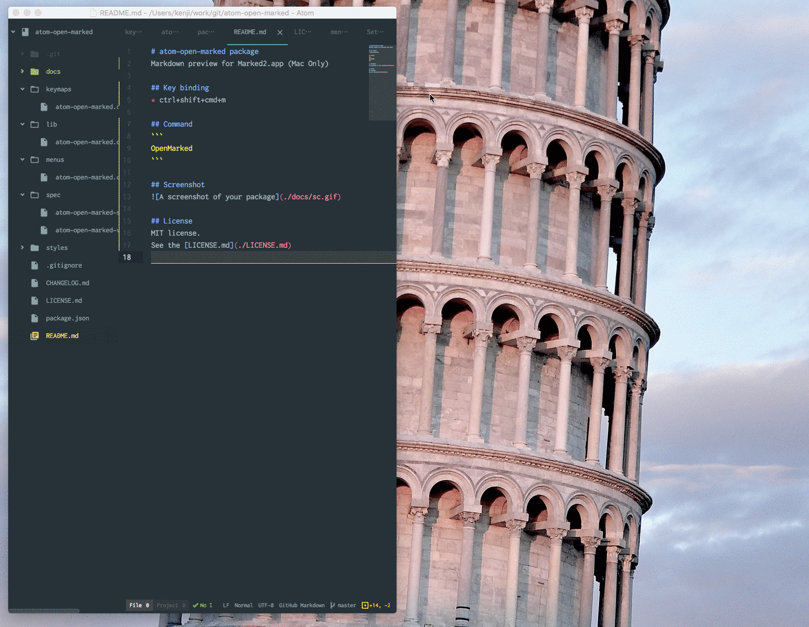

# atom-open-marked package
Markdown preview in Marked2.app (Mac Only)

## Required
[Marked2](https://itunes.apple.com/us/app/marked-2/id890031187?ls=1&mt=12)

## Key binding
* ctrl+shift+cmd+m

## Command
```
OpenMarked
```

## Screenshot


## License
MIT license.
See the [LICENSE.md](./LICENSE.md)
